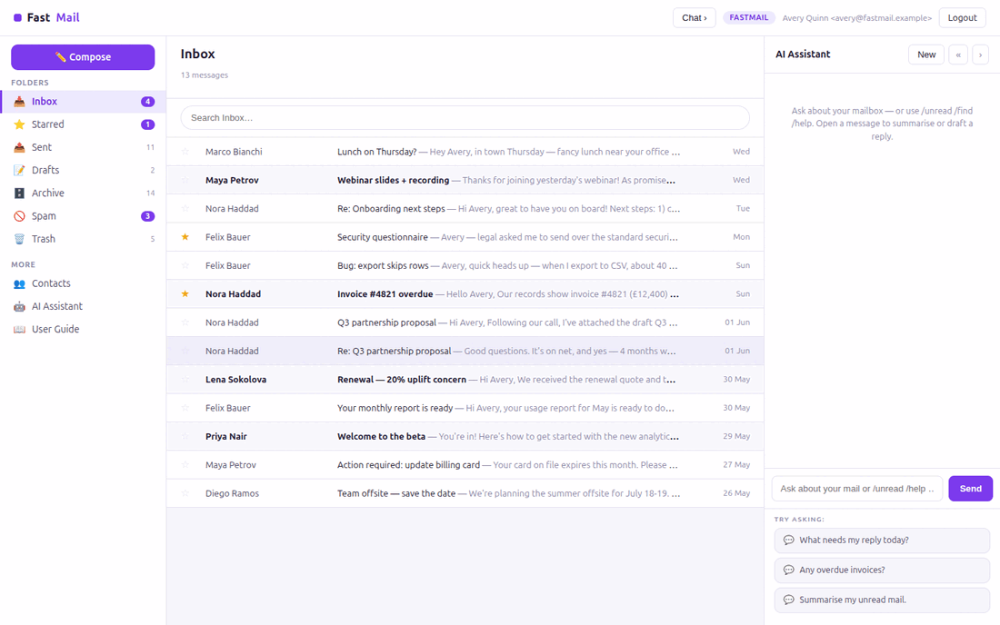

# FastMail

**FastMail** is an open-source **webmail client** built with
[FastHTML](https://fastht.ml) — a server-side, HTMX-driven take on the *client*
half of [Frappe Mail](https://github.com/frappe/mail). Python-first, no
JavaScript framework: folders, a message list, a threaded reading pane, compose,
an address book, and **AI summarise-thread / draft-reply**.

*Your inbox, calmer.* Runs on port **5009**.

> **Synthetic data only.** Everything runs on a deterministic, fully synthetic
> mailbox generated by `seed.py` — no real people or messages.

## Demo



## Quickstart (native)

```bash
python -m venv .venv
.venv/bin/python -m pip install -r requirements.txt
cp .env.sample .env          # add an LLM key for AI summarise/draft + chat
.venv/bin/python web_app.py  # http://localhost:5009  (self-seeds on first boot)
```

Login: `admin@fastmail.example` / `FastMail2026$`. Rebuild the mailbox with
`.venv/bin/python seed.py`.

## Run with Docker

```bash
docker compose up --build      # http://localhost:5009
```

`Dockerfile` (python:3.12-slim, port 5009) seeds on first boot;
`docker-compose.yml` mounts a `fastmail-data` volume at `/data`.

## Module tour

- **Folders** — Inbox, Starred, Sent, Drafts, Archive, Spam, Trash, each with
  unread badges. Message list shows sender, subject, snippet and date, with
  **inline star** (HTMX) and unread emphasis.
- **Reading pane** (`/message/{id}`) — the whole **thread** with avatars; star,
  reply, or use AI to **summarise the thread** or **draft a reply**.
- **Compose** (`/compose`) — write new mail (saved to Sent); reply pre-fills the
  quote.
- **Contacts** (`/contacts`) — the address book.
- **AI Assistant** (right rail) — chat grounded in a live mailbox snapshot;
  slash-commands `/unread`, `/find <text>`, `/starred` work with **no API key**.

## AI features

- **Summarise thread** — condenses a whole conversation to 2-3 bullets + a
  suggested next action.
- **Draft reply** — writes a brief, professional reply you can edit before
  sending.
- Both call the configured provider on demand (per message); the rest of the
  client works with no key.

```ini
MODEL_PROVIDER=xai          # xai | openai | anthropic | google
MODEL_NAME=grok-4-1-fast-reasoning
XAI_API_KEY=...
```

## Architecture

```
web_app.py        routes, auth, star/compose/send, AI summarise/draft, SSE chat
db.py             SQLite mailbox schema + folder/thread reads
seed.py           deterministic synthetic mailbox
web/layout.py     3-pane shell (folder nav with counts), CSS, chat JS
web/views.py      message list, reading pane, compose, contacts
web/ai.py         chat, slash-commands, summarise_thread(), draft_reply()
```

See **[SKILLS.md](SKILLS.md)** and **[docs/ROADMAP.md](docs/ROADMAP.md)** (comparison
vs Frappe Mail). Part of the
[`fasthtml-oss-migrations`](https://github.com/predictivelabsai/fasthtml-oss-migrations)
initiative.

## Licence

MIT.
