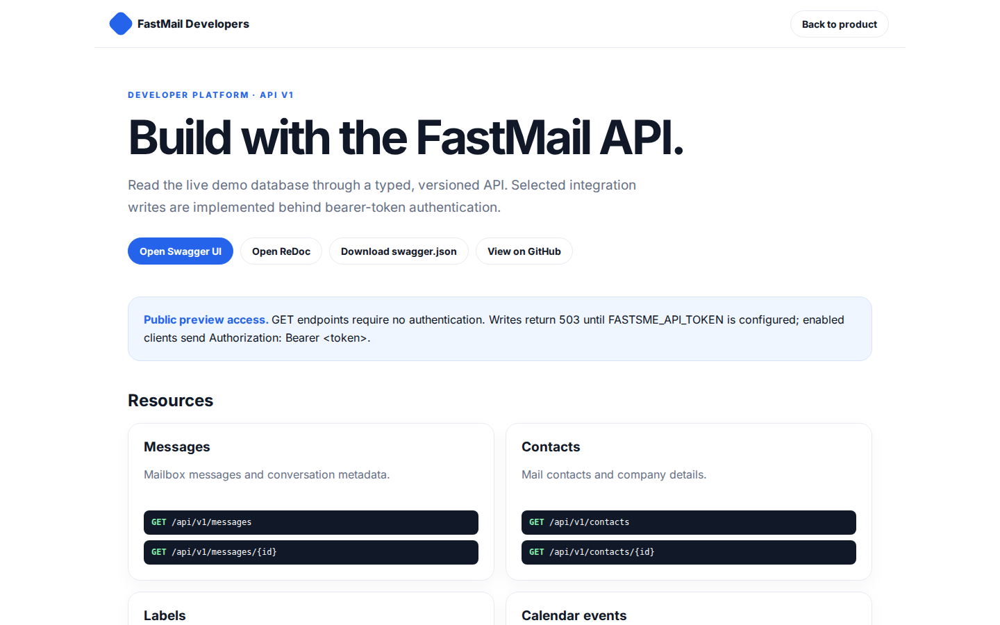

# FastMail Platform Guide

**Published:** 2026-08-19
**Platform:** [https://mail.fastsme.com](https://mail.fastsme.com)
**Source:** [github.com/predictivelabsai/FastMail](https://github.com/predictivelabsai/FastMail)

## Platform overview

**FastMail** is an open-source **webmail client** built with — a server-side, HTMX-driven take on the *client* half of . Python-first, no JavaScript framework: folders, a message list, a threaded reading pane, compose, an address book, and **AI summarise-thread / draft-reply**.

This visual guide was reviewed against the live product using Playwright. Screens and available navigation can vary by account, role, and deployment configuration.

## 1. An inbox built around getting work done.

TEAM EMAIL An inbox built around getting work done. Read threaded email, compose and organise messages, manage contacts and calendars, and draft faster with AI. Sign In or Register Explore the open-source suite → Product tour · see the workspace in action 01 T

Screen reviewed at: [https://mail.fastsme.com/](https://mail.fastsme.com/)

## 2. Build with the FastMail API.

FastMail Developers Back to product DEVELOPER PLATFORM · API V1 Build with the FastMail API. Read the live demo database through a typed, versioned API. Selected integration writes are implemented behind bearer-token authentication. Open Swagger UI Open ReDoc

Screen reviewed at: [https://mail.fastsme.com/developers](https://mail.fastsme.com/developers)

## 3. Sign in

Sign in with Google Sign in to continue to fastsme.com Email or phone Forgot email? Next Create account Afrikaans azərbaycan bosanski català Čeština Cymraeg Dansk Deutsch eesti English (United Kingdom) English (United States) Español (España) Español (Latinoam

Screen reviewed at: [https://accounts.google.com/v3/signin/identifier?opparams=%253F&dsh=S960243515%3A1787122791160142&access_type=online&client_id=887059023987-2a7spj1m82eivobdbt1itb3cqca6tpt1.apps.googleusercontent.com&o2v=2&prompt=select_account&redirect_uri=https%3A%2F%2Fmail.fastsme.com%2Fauth%2Fgoogle%2Fcallback&response_type=code&scope=openid+email+profile&service=lso&state=Ts7Ae8n26eaiepwwdNH8XmymKRHeFE4L_W8FcuuNtNM&flowName=GeneralOAuthLite&continue=https%3A%2F%2Faccounts.google.com%2Fsignin%2Foauth%2Flegacy%2Fconsent%3Fauthuser%3Dunknown%26part%3DAJi8hAO2tQ68nqvorkZeNv0w-caccZOTOq_EJwo3XG6mr2PuDIJHgHcKFrbjDl8EkDJxoHox2-uXth75y6AmLleSNl_t3SPTwb38UW6JLGmiBEkvLl2jtZ7-OFsAiNG4-X2tVaW-SJKEVaWPRnm4YIh3GifRAAZ528nptUwUqGC7ENOjeL3r0XvQuZvuUkavxtid4Dg8gy7xXZ7amwVNBmVSFTlwX6Y97cy1_BrxxEHD3rGK-8TjHe5S0cOz3W9248_BXlNRWKYoF5bmP9V49q8YoTDa7SLDUbNQCsTpY5spug4XI4pjhUYddwUk2rimBW6o0G6vQxH-ziF4NfTDCshnyFzSGipNepOjHF2fPM_odtXZXNxE4antvdp1MCbI9Dh7eMmxVGmzaH35355YGQPxH_RrzWJ2R4Xst6PnR3QLK8KhcIDf2UdLzSnxmxn_xt74-Aa4Okyl_ObZDM00_apgaUq3l93fFQ%26flowName%3DGeneralOAuthFlow%26as%3DS960243515%253A1787122791160142%26client_id%3D887059023987-2a7spj1m82eivobdbt1itb3cqca6tpt1.apps.googleusercontent.com%23&app_domain=https%3A%2F%2Fmail.fastsme.com&rart=ANgoxceAO616X5MvGSvbY2WfvepYQh1zhjrfzIrOYP7lEydthhCoLnxDTT2D29LeuomFs1Robk34XuHR9464nKoG-oiszf7nrNoaTIiQQQj8EgvHvaDculE](https://accounts.google.com/v3/signin/identifier?opparams=%253F&dsh=S960243515%3A1787122791160142&access_type=online&client_id=887059023987-2a7spj1m82eivobdbt1itb3cqca6tpt1.apps.googleusercontent.com&o2v=2&prompt=select_account&redirect_uri=https%3A%2F%2Fmail.fastsme.com%2Fauth%2Fgoogle%2Fcallback&response_type=code&scope=openid+email+profile&service=lso&state=Ts7Ae8n26eaiepwwdNH8XmymKRHeFE4L_W8FcuuNtNM&flowName=GeneralOAuthLite&continue=https%3A%2F%2Faccounts.google.com%2Fsignin%2Foauth%2Flegacy%2Fconsent%3Fauthuser%3Dunknown%26part%3DAJi8hAO2tQ68nqvorkZeNv0w-caccZOTOq_EJwo3XG6mr2PuDIJHgHcKFrbjDl8EkDJxoHox2-uXth75y6AmLleSNl_t3SPTwb38UW6JLGmiBEkvLl2jtZ7-OFsAiNG4-X2tVaW-SJKEVaWPRnm4YIh3GifRAAZ528nptUwUqGC7ENOjeL3r0XvQuZvuUkavxtid4Dg8gy7xXZ7amwVNBmVSFTlwX6Y97cy1_BrxxEHD3rGK-8TjHe5S0cOz3W9248_BXlNRWKYoF5bmP9V49q8YoTDa7SLDUbNQCsTpY5spug4XI4pjhUYddwUk2rimBW6o0G6vQxH-ziF4NfTDCshnyFzSGipNepOjHF2fPM_odtXZXNxE4antvdp1MCbI9Dh7eMmxVGmzaH35355YGQPxH_RrzWJ2R4Xst6PnR3QLK8KhcIDf2UdLzSnxmxn_xt74-Aa4Okyl_ObZDM00_apgaUq3l93fFQ%26flowName%3DGeneralOAuthFlow%26as%3DS960243515%253A1787122791160142%26client_id%3D887059023987-2a7spj1m82eivobdbt1itb3cqca6tpt1.apps.googleusercontent.com%23&app_domain=https%3A%2F%2Fmail.fastsme.com&rart=ANgoxceAO616X5MvGSvbY2WfvepYQh1zhjrfzIrOYP7lEydthhCoLnxDTT2D29LeuomFs1Robk34XuHR9464nKoG-oiszf7nrNoaTIiQQQj8EgvHvaDculE)

## Getting started

Visit [https://mail.fastsme.com](https://mail.fastsme.com) to explore FastMail. For source code and deployment details, use the GitHub link above.
